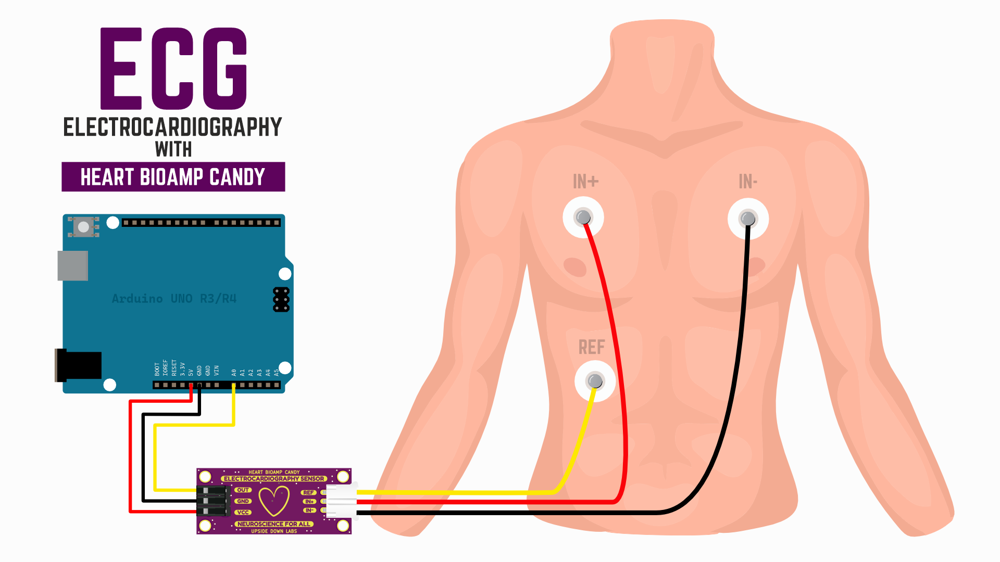
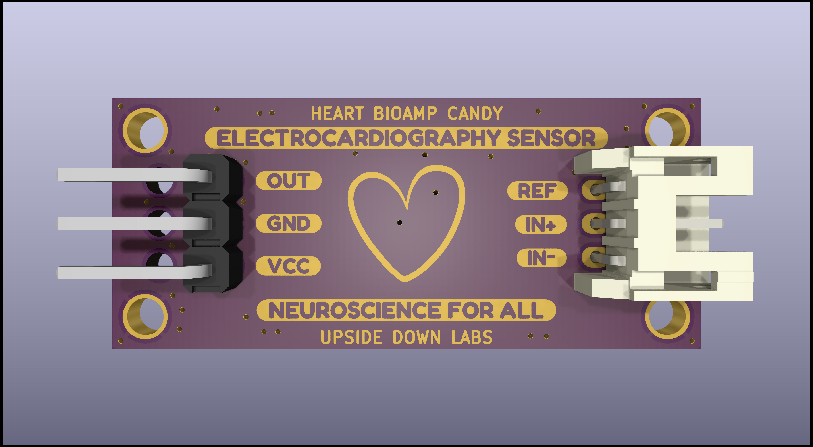

# Heart BioAmp Candy

[-white)](https://store.upsidedownlabs.tech/product/heart-bioamp-candy/)
 

Heart BioAmp Candy is a candy-sized sensor for recording ECG signals easily. It is perfect for students and researchers as it offers reliable and accurate ECG recordings, making heart monitoring accessible and convenient for educational and research purposes.

## Specifications

|Specs |      |
| ---- | ---- |
| Input Voltage | 2.7 V - 5 V |
| Fixed Gain | x2157 |
| Bandpass filter | 0.5 - 34 Hz |
| Compatible hardware | Any development board with an ADC (Arduino UNO R3/R4, Arduino Nano, Adafruit QtPy, STM32 Blue Pill, BeagleBone Black, Raspberry Pi Pico, to name just a few) or any standalone ADC of your choice |
| Biopotentials | ECG |
| No. of channels | 1 |
| Electrodes | 3 (Positive, Negative, and Reference) |
| Dimensions | 3.5 x 1.5 cm |
| Open-source | hardware + software |

## Hardware

Heart BioAmp Candy has been created using KiCad and all the design files can be found under [hardware](hardware/) folder, including [Interactive BOM](hardware/bom) file. Images below shows a quick overview of the hardware design.

## License

CERN Open Hardware License Version 2 - Strongly Reciprocal ([CERN-OHL-S-2.0](https://spdx.org/licenses/CERN-OHL-S-2.0.html)).
