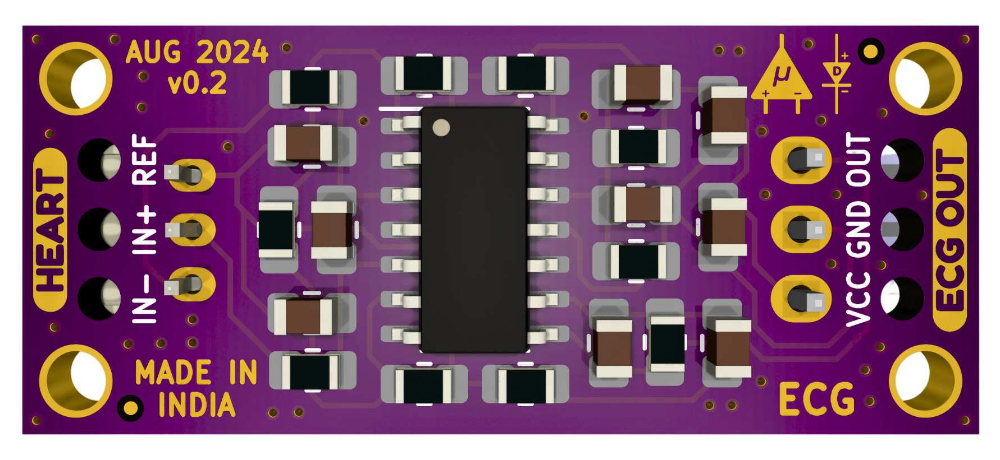
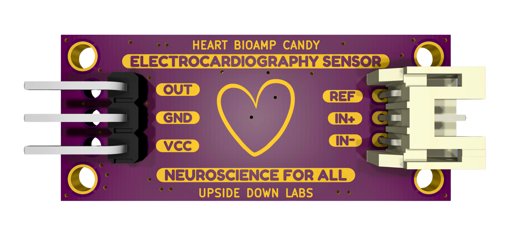

# Heart BioAmp Candy

## Hardware

Heart BioAmp Candy has been created using KiCad and all the design files can be found under [hardware](hardware/) folder, including [Interactive BOM](hardware/bom) file. Images below shows a quick overview of the hardware design.

## License

CERN Open Hardware License Version 2 - Strongly Reciprocal ([CERN-OHL-S-2.0](https://spdx.org/licenses/CERN-OHL-S-2.0.html)).
